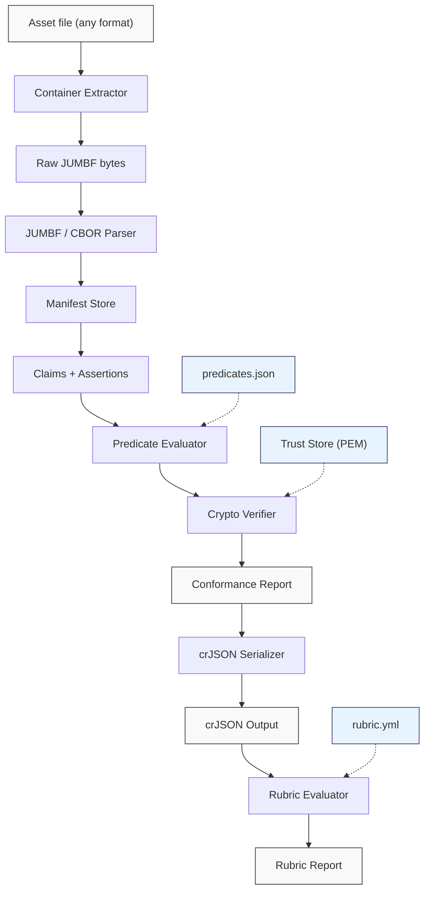

# C2PA Conformance Suite

Deterministic conformance testing for C2PA implementations, driven by declarative
predicates from the [C2PA Knowledge Graph](https://github.com/encypherai/c2pa-knowledge-graph).
Evaluates implementation correctness against all 242 normative validation rules in the
C2PA v2.4 specification without requiring human judgment. Produces
[crJSON](https://github.com/c2pa-org/conformance) output compatible with the C2PA
conformance program rubric system.

## Quick start

```bash
# Clone and install
git clone https://github.com/encypherai/c2pa-conformance-suite.git
cd c2pa-conformance-suite
pip install -e ".[dev]"

# Validate a single asset
c2pa-conform validate signed-image.jpg

# Validate and emit crJSON output
c2pa-conform validate signed-image.jpg --output-format crjson --output results.json

# Validate a directory of assets
c2pa-conform suite ./my-assets/ --output report.json

# Run a conformance rubric against an asset
c2pa-conform rubric signed-image.jpg --rubric conformance-0.2-spec-2.4.yml

# Compare results against c2pa-tool
c2pa-conform compare signed-image.jpg
```

Predicates are bundled in the package. No external files required for basic usage.

## Architecture



The pipeline is format-agnostic after extraction. Each container format has a thin
extractor that locates the embedded JUMBF superbox and returns raw bytes. From that
point forward, all formats follow the same parse, evaluate, verify path. The crJSON
serializer transforms validation results into the C2PA conformance program's standard
JSON-LD format, which the rubric evaluator can then assess against conformance program
rubrics.

## CLI commands

### `validate` - Single asset

```bash
c2pa-conform validate photo.jpg
c2pa-conform validate photo.jpg --trust-store my-ca.pem
c2pa-conform validate photo.jpg --binding c2pa.hash.data --output report.json
```

Runs the full pipeline on one file: extract, parse, evaluate predicates, verify
cryptographic bindings. Prints pass/fail/skip counts and lists failures.

Options:

| Flag | Purpose |
|------|---------|
| `--predicates` | Path to a custom predicates.json (default: bundled) |
| `--trust-store` | PEM file with trust anchor certificates |
| `--binding` | Filter predicates to a specific binding mechanism |
| `--output` | Write full JSON report to file |
| `--output-format` | `json` (default predicate report) or `crjson` (C2PA conformance JSON) |

### `suite` - Batch validation

```bash
c2pa-conform suite ./assets/
c2pa-conform suite ./assets/ --trust-store ca-bundle.pem --output report.json
c2pa-conform suite ./assets/ --fail-fast
```

Recursively scans a directory for supported file types and validates each one.
Prints per-file pass/fail status and a summary at the end.

Options:

| Flag | Purpose |
|------|---------|
| `--predicates` | Custom predicates.json |
| `--trust-store` | PEM trust anchors |
| `--output` | JSON report with per-file results and summary |
| `--format` | Output format: `text` (default) or `json` |
| `--fail-fast` | Stop on first failure |
| `--known-failures` | JSON file mapping filenames to expected-failure reasons |

### `rubric` - Conformance rubric evaluation

```bash
# Validate asset and evaluate rubric in one step
c2pa-conform rubric photo.jpg --rubric conformance-0.2-spec-2.4.yml

# Evaluate rubric against pre-generated crJSON
c2pa-conform rubric --rubric rubric.yml --crjson-input results.json

# JSON output
c2pa-conform rubric photo.jpg --rubric rubric.yml --format json --output rubric-report.json
```

Runs the full validation pipeline, serializes results to crJSON, then evaluates
a conformance program rubric (multi-document YAML with jmespath expressions) against
the crJSON output. Alternatively accepts pre-generated crJSON via `--crjson-input`.

Options:

| Flag | Purpose |
|------|---------|
| `--rubric` | Path to rubric YAML file (required) |
| `--crjson-input` | Pre-generated crJSON file (skips asset validation) |
| `--predicates` | Custom predicates.json |
| `--trust-store` | PEM trust anchors |
| `--output` | Write JSON rubric report to file |
| `--format` | Output format: `text` (default) or `json` |

### `compare` - Side-by-side with c2pa-tool

```bash
c2pa-conform compare photo.jpg
c2pa-conform compare photo.jpg --output comparison.json
```

Runs both the conformance suite and `c2pa-tool` (must be in PATH) against the same
asset, normalizes both outputs, and diffs the results.

### `generate-pki` - Test certificates

```bash
c2pa-conform generate-pki
c2pa-conform generate-pki --output-dir ./my-pki
```

Generates a test PKI certificate hierarchy for signing test vectors.

### `generate-vectors` - Test fixtures

```bash
c2pa-conform generate-vectors
c2pa-conform generate-vectors --categories structural,crypto --clean
```

Generates deterministic C2PA test vectors with known-good and known-bad manifests.

### `report` - Read a saved report

```bash
c2pa-conform report report.json
```

Prints a human-readable summary of a previously saved JSON conformance report.

## Supported formats

| Format | Extensions | Extractor |
|--------|-----------|-----------|
| JPEG | `.jpg`, `.jpeg`, `.jpe` | APP11 JUMBF boxes |
| PNG | `.png` | `caBX` chunks |
| TIFF/DNG | `.tif`, `.tiff`, `.dng` | IFD tag 0xCB02 |
| BMFF (MP4, HEIF, AVIF) | `.mp4`, `.m4a`, `.m4v`, `.mov`, `.heif`, `.heic`, `.avif`, `.3gp` | UUID boxes |
| RIFF/WebP | `.wav`, `.webp`, `.avi` | C2PA chunks |
| PDF | `.pdf` | C2PA annotation |
| JPEG XL | `.jxl` | JUMBF boxes |
| GIF | `.gif` | Application extension blocks |
| SVG | `.svg`, `.xml` | Embedded metadata |
| HTML | `.html`, `.htm` | Embedded metadata |
| FLAC | `.flac` | Metadata blocks |
| Ogg | `.ogg`, `.opus` | Comment packets |
| ID3 (MP3) | `.mp3` | ID3v2 frames |
| Font | `.ttf`, `.otf`, `.woff2` | Table entries |
| Text | `.txt`, `.md` | Sidecar detection |
| ZIP (EPUB, OOXML, ODF) | `.zip`, `.epub`, `.docx`, `.xlsx`, `.pptx`, `.odt` | Archive entries |

## Custom trust stores

By default, signature verification runs without a trust anchor, which means chain
structure and algorithm correctness are checked but trust is not evaluated. To validate
against your own PKI:

```bash
# Use your organization's CA bundle
c2pa-conform validate asset.jpg --trust-store /path/to/ca-bundle.pem

# Or generate a test PKI to experiment with
c2pa-conform generate-pki --output-dir ./test-pki
```

The `--trust-store` flag accepts any PEM file containing one or more X.509 certificates.
The verifier walks the full chain from signer through intermediates to a trust anchor,
checks EKU constraints, validates expiry windows, and processes OCSP stapled responses
when present.

## Predicate engine

The evaluator loads `predicates.json` (bundled or user-supplied) and runs each predicate's
condition tree against the evaluation context built from the parsed manifest. Each predicate
maps to one or more C2PA validation rules and produces a pass, fail, skip, or informational
result with the corresponding C2PA status code.

The engine implements 72 condition operators covering:

- **Structural**: field presence, type dispatch, sequence checks, manifest store validation
- **Cryptographic**: signature verification, certificate validation, hash computation, OCSP
- **Logical**: all-of, or, if/then/else, for-each, delegation, priority fallback
- **Format-specific**: BMFF Merkle trees, boxes hash exclusion ranges, PDF byte offsets
- **Comparison**: equality, ordering, regex, set membership, subset checks

Predicates are loaded from the [C2PA Knowledge Graph](https://github.com/encypherai/c2pa-knowledge-graph).
To sync the latest version:

```bash
./scripts/sync_predicates.sh
```

## Project structure

```
src/c2pa_conformance/
  binding/       Hash binding validators (BMFF, boxes, collection, data, text)
  builder/       Manifest construction and two-pass signing for test vectors
  compare/       Side-by-side comparison with c2pa-tool
  crypto/        COSE, X.509, OCSP, TSA, hashing, trust store
  data/          Bundled predicates.json (150 predicates, 242 rules)
  embedders/     JUMBF embedding into containers (JPEG, PNG, sidecar)
  evaluator/     Predicate evaluation engine (72 operators)
  extractors/    Container format extractors (16 formats)
  parser/        JUMBF/CBOR parsing, manifest and ingredient models
  rubric/        Conformance program rubric evaluator (jmespath + YAML)
  serializer/    crJSON output serializer (C2PA conformance JSON-LD)
  vectors/       Test vector generation and mutation framework
```

## Contributing

See [CONTRIBUTING.md](CONTRIBUTING.md) for development setup, predicate sync workflow,
and code style requirements.

## License

Apache License 2.0. See [LICENSE](LICENSE).

Copyright 2026 Encypher Corporation
